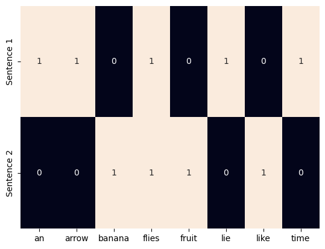
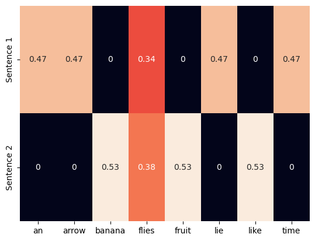

CHAPTER1_INTRODUCTION_BASIC_TENSOR
# Chapter 1. Introduction

Practice Basic NLP method to represent data and etc

## TF and TF-IDF


```python
# TF (Term Frequency)

from sklearn.feature_extraction.text import CountVectorizer
import seaborn as sns

corpus = ["Time flies lie an arrow.", "Fruit flies like a banana."]

one_hot_vectorizer = CountVectorizer(binary = True)
one_hot = one_hot_vectorizer.fit_transform(corpus).toarray()
vocab = one_hot_vectorizer.get_feature_names_out() # method declaration has been changed from get_feature_names() 
sns.heatmap(one_hot, annot=True, cbar=False,
            xticklabels=vocab, 
            yticklabels = ["Sentence 1", "Sentence 2"])


```


    <Axes: >


    

    


```python
# TF - IDF

from sklearn.feature_extraction.text import TfidfVectorizer
import seaborn as sns

tfidf_vectorizer = TfidfVectorizer()
tfidf = tfidf_vectorizer.fit_transform(corpus).toarray()
sns.heatmap(tfidf, annot=True, cbar=False, xticklabels=vocab, yticklabels= ["Sentence 1", "Sentence 2"])
```


    <Axes: >


    

    


## Basic of PyTorch

### Generate Tensor


```python
# helper function to describe Tensor

def describe(x):
  print("Type : {}".format(x.type()))
  print("Size : {}".format(x.shape))
  print("Value \n{}".format(x))
  print("\n")
```


```python
import torch

# Random init
describe(torch.Tensor(2,3))

# initialize from uniform distribution or standard normal distribution
describe(torch.rand(2,3)) # uniform distribution
describe(torch.randn(2,3)) # standard normal distribution
```

    Type : torch.FloatTensor
    Size : torch.Size([2, 3])
    Value 
    tensor([[0., 0., 0.],
            [0., 0., 0.]])
    
    
    Type : torch.FloatTensor
    Size : torch.Size([2, 3])
    Value 
    tensor([[0.6073, 0.4973, 0.3629],
            [0.1205, 0.9591, 0.6963]])
    
    
    Type : torch.FloatTensor
    Size : torch.Size([2, 3])
    Value 
    tensor([[-0.4376, -0.8057,  0.4015],
            [ 0.0627,  0.9801, -2.1447]])
    
    


```python
# initialize with specific scalar

x_zeros = torch.zeros(2,3) # fill with zero
x_ones = torch.ones(2,3)
x_filled = x_ones.fill_(5)

describe(x_zeros)
describe(x_ones)
describe(x_filled)
```

    Type : torch.FloatTensor
    Size : torch.Size([2, 3])
    Value 
    tensor([[0., 0., 0.],
            [0., 0., 0.]])
    
    
    Type : torch.FloatTensor
    Size : torch.Size([2, 3])
    Value 
    tensor([[5., 5., 5.],
            [5., 5., 5.]])
    
    
    Type : torch.FloatTensor
    Size : torch.Size([2, 3])
    Value 
    tensor([[5., 5., 5.],
            [5., 5., 5.]])
    
    


```python
# make Tensor using python list

x = torch.Tensor([[1,2,3],
                  [4,5,6]])
describe(x)

# make Tensor using numpy array
import numpy as np

npy = np.random.rand(2,3)
x = torch.from_numpy(npy)
describe(x)
```

    Type : torch.FloatTensor
    Size : torch.Size([2, 3])
    Value 
    tensor([[1., 2., 3.],
            [4., 5., 6.]])
    
    
    Type : torch.DoubleTensor
    Size : torch.Size([2, 3])
    Value 
    tensor([[0.5059, 0.6002, 0.2974],
            [0.9462, 0.1197, 0.9513]], dtype=torch.float64)
    
    


```python
# using torch.Tensor, basic tensor type is torch.FloatTensor
# Type Casting : float, long, double

x = torch.FloatTensor([[1,2,3], [4,5,6]])
describe(x)

# long tensor
x_long = x.long()
describe(x_long)

# using dtype
x = torch.tensor([[1,2,3], [4,5,6]], dtype=torch.int64)
describe(x)

# make it flot tensfor
x_float = x.float()
describe(x_float)
```

    Type : torch.FloatTensor
    Size : torch.Size([2, 3])
    Value 
    tensor([[1., 2., 3.],
            [4., 5., 6.]])
    
    
    Type : torch.LongTensor
    Size : torch.Size([2, 3])
    Value 
    tensor([[1, 2, 3],
            [4, 5, 6]])
    
    
    Type : torch.LongTensor
    Size : torch.Size([2, 3])
    Value 
    tensor([[1, 2, 3],
            [4, 5, 6]])
    
    
    Type : torch.FloatTensor
    Size : torch.Size([2, 3])
    Value 
    tensor([[1., 2., 3.],
            [4., 5., 6.]])
    
    


### Tenor Math-Operation


```python
# add

x = torch.randn(2,3)
describe(x)
describe(torch.add(x,x))
describe(x + x)

```

    Type : torch.FloatTensor
    Size : torch.Size([2, 3])
    Value 
    tensor([[ 1.0176,  0.2334, -0.1892],
            [ 0.1365, -0.1302, -0.2565]])
    
    
    Type : torch.FloatTensor
    Size : torch.Size([2, 3])
    Value 
    tensor([[ 2.0352,  0.4668, -0.3784],
            [ 0.2730, -0.2605, -0.5131]])
    
    
    Type : torch.FloatTensor
    Size : torch.Size([2, 3])
    Value 
    tensor([[ 2.0352,  0.4668, -0.3784],
            [ 0.2730, -0.2605, -0.5131]])
    
    


```python
# Tensor math operation rely on Dimenson

x = torch.arange(6)
describe(x)

# generate tensor sharing same data (pointer)
x = x.view(2,3)
describe(x)

describe(torch.sum(x, dim=0))
describe(torch.sum(x, dim=1))
describe(torch.transpose(x, 0, 1))
```

    Type : torch.LongTensor
    Size : torch.Size([6])
    Value 
    tensor([0, 1, 2, 3, 4, 5])
    
    
    Type : torch.LongTensor
    Size : torch.Size([2, 3])
    Value 
    tensor([[0, 1, 2],
            [3, 4, 5]])
    
    
    Type : torch.LongTensor
    Size : torch.Size([3])
    Value 
    tensor([3, 5, 7])
    
    
    Type : torch.LongTensor
    Size : torch.Size([2])
    Value 
    tensor([ 3, 12])
    
    
    Type : torch.LongTensor
    Size : torch.Size([3, 2])
    Value 
    tensor([[0, 3],
            [1, 4],
            [2, 5]])
    
    


### Indexing, Slicing, Concat


```python
# indexing

x = torch.arange(6).view(2,3)
describe(x)
describe(x[:1, :2])
describe(x[0,1])

# indices always have to be LongTensor
indices = torch.LongTensor([0,2])
describe(torch.index_select(x, dim=1, index=indices))

indices = torch.LongTensor([0, 0])
describe(torch.index_select(x, dim=0, index=indices))

row_indicies = torch.arange(2).long()
col_indicies = torch.LongTensor([0, 1])
describe(x[row_indicies, col_indicies])
```

    Type : torch.LongTensor
    Size : torch.Size([2, 3])
    Value 
    tensor([[0, 1, 2],
            [3, 4, 5]])
    
    
    Type : torch.LongTensor
    Size : torch.Size([1, 2])
    Value 
    tensor([[0, 1]])
    
    
    Type : torch.LongTensor
    Size : torch.Size([])
    Value 
    1
    
    
    Type : torch.LongTensor
    Size : torch.Size([2, 2])
    Value 
    tensor([[0, 2],
            [3, 5]])
    
    
    Type : torch.LongTensor
    Size : torch.Size([2, 3])
    Value 
    tensor([[0, 1, 2],
            [0, 1, 2]])
    
    
    Type : torch.LongTensor
    Size : torch.Size([2])
    Value 
    tensor([0, 4])
    
    


```python
# Concat

x = torch.arange(6, dtype=torch.float).view(2,3)
describe(x)

# using cat method
describe(torch.cat([x,x], dim=0))
describe(torch.cat([x,x], dim=1))

# using stack
describe(torch.stack([x, x]))

```

    Type : torch.FloatTensor
    Size : torch.Size([2, 3])
    Value 
    tensor([[0., 1., 2.],
            [3., 4., 5.]])
    
    
    Type : torch.FloatTensor
    Size : torch.Size([4, 3])
    Value 
    tensor([[0., 1., 2.],
            [3., 4., 5.],
            [0., 1., 2.],
            [3., 4., 5.]])
    
    
    Type : torch.FloatTensor
    Size : torch.Size([2, 6])
    Value 
    tensor([[0., 1., 2., 0., 1., 2.],
            [3., 4., 5., 3., 4., 5.]])
    
    
    Type : torch.FloatTensor
    Size : torch.Size([2, 2, 3])
    Value 
    tensor([[[0., 1., 2.],
             [3., 4., 5.]],
    
            [[0., 1., 2.],
             [3., 4., 5.]]])
    
    


```python
# matrix multiplication
x1 = torch.arange(6, dtype=torch.float).view(2,3)
describe(x1)

x2 = torch.ones(3,2)
x2[:,1] += 1
describe(x2)

describe(torch.mm(x1, x2))
```

    Type : torch.FloatTensor
    Size : torch.Size([2, 3])
    Value 
    tensor([[0., 1., 2.],
            [3., 4., 5.]])
    
    
    Type : torch.FloatTensor
    Size : torch.Size([3, 2])
    Value 
    tensor([[1., 2.],
            [1., 2.],
            [1., 2.]])
    
    
    Type : torch.FloatTensor
    Size : torch.Size([2, 2])
    Value 
    tensor([[ 3.,  6.],
            [12., 24.]])
    
    


### Tensor and Calculation Graph


```python
# using requires_grad to record loss function and gradient

x = torch.ones(2, 2, requires_grad=True)
describe(x)
print(x.grad is None)

y = (x + 2) * (x + 5) + 3
describe(y)
print(x.grad is None)

z = y.mean()
describe(z)
#Using Backward, it calculates Back propagation
z.backward()
print(x.grad is None)
```

    Type : torch.FloatTensor
    Size : torch.Size([2, 2])
    Value 
    tensor([[1., 1.],
            [1., 1.]], requires_grad=True)
    
    
    True
    Type : torch.FloatTensor
    Size : torch.Size([2, 2])
    Value 
    tensor([[21., 21.],
            [21., 21.]], grad_fn=<AddBackward0>)
    
    
    True
    Type : torch.FloatTensor
    Size : torch.Size([])
    Value 
    21.0
    
    
    False


## CUDA Tensor


```python
device = torch.device('mps:0' if torch.backends.mps.is_available() else 'cpu')
print(device)

x = torch.rand(3,3).to(device)
describe(x)
```

    mps:0
    Type : torch.mps.FloatTensor
    Size : torch.Size([3, 3])


    /opt/homebrew/anaconda3/envs/NLP/lib/python3.8/site-packages/torch/_tensor_str.py:137: UserWarning: MPS: nonzero op is supported natively starting from macOS 13.0. Falling back on CPU. This may have performance implications. (Triggered internally at /Users/runner/work/_temp/anaconda/conda-bld/pytorch_1695391828857/work/aten/src/ATen/native/mps/operations/Indexing.mm:283.)
      nonzero_finite_vals = torch.masked_select(


    Value 
    tensor([[0.0234, 0.1825, 0.7494],
            [0.9650, 0.4083, 0.9163],
            [0.0560, 0.4266, 0.7730]], device='mps:0')
    
    


```python
y = torch.rand(3,3)
x + y
```


    ---------------------------------------------------------------------------

    RuntimeError                              Traceback (most recent call last)

    /Users/wooseokjung/CodeWork/NLPwithPyTorch/JupyterNotebooks/Chapter1.ipynb 셀 21 line 2
          <a href='vscode-notebook-cell:/Users/wooseokjung/CodeWork/NLPwithPyTorch/JupyterNotebooks/Chapter1.ipynb#X34sZmlsZQ%3D%3D?line=0'>1</a> y = torch.rand(3,3)
    ----> <a href='vscode-notebook-cell:/Users/wooseokjung/CodeWork/NLPwithPyTorch/JupyterNotebooks/Chapter1.ipynb#X34sZmlsZQ%3D%3D?line=1'>2</a> x + y


    RuntimeError: Expected all tensors to be on the same device, but found at least two devices, mps:0 and cpu!


```python
cpu_device = torch.device("cpu")
y = y.to(cpu_device)
x = x.to(cpu_device)
x + y
```


    tensor([[0.7107, 0.2351, 1.2380],
            [1.5625, 0.5897, 1.1399],
            [0.6699, 1.2387, 1.2431]])


## Practice

1. 2D텐서를 만들고 차원 0 위치에 크기가 1인 차원을 추가하라
2. 이전 텐서에 추가한 차원을 삭제하라
3. 범위가 [3,7) 이고 크기가 5x3인 랜덤한 텐서를 만들어라
4. 정규분포 (평균=0, 표준편차=1)를 사용해 텐서를 만드세요
5. 텐서 torch.Tensor([1, 1, 1, 0, 1])애서 0이 아닌 원소의 인덱스를 추출하라
6. 크기가 (3,1)인 랜덤한 텐서를 만들고 네벌을 복사해서 쌓으세요
7. 2차원 행렬 두개 (a = torch.rand(3,4,5), b=torch.rand(3,5,4)의 배치 행렬 곱셈을 계산하세요)
8. 3차원 행렬 (a = torch.rand(3,4,5))과 2차원 행렬 (b=torch.rand(5,4))의 배치행렬 곱셈을 계산하세요.


```python
## Practice

# 1. 2D텐서를 만들고 차원 0 위치에 크기가 1인 차원을 추가하라

a = torch.rand(3,3)
describe(a)
a = a.unsqueeze(0)
describe(a)

# 2. 이전 텐서에 추가한 차원을 삭제하라
a = a.squeeze(0)
describe(a)

# 3. 범위가 [3,7) 이고 크기가 5x3인 랜덤한 텐서를 만들어라
a = torch.rand(5,3) * (7-3)
describe(a)

# 4. 정규분포 (평균=0, 표준편차=1)를 사용해 텐서를 만드세요
a = torch.randn(3,3)
a

# 5. 텐서 torch.Tensor([1, 1, 1, 0, 1])애서 0이 아닌 원소의 인덱스를 추출하라
a = torch.Tensor([1, 1, 1, 0, 1])
torch.nonzero(a)


# 6. 크기가 (3,1)인 랜덤한 텐서를 만들고 네벌을 복사해서 쌓으세요
a = torch.rand(3,1)
a.expand(3,4)


# 7. 2차원 행렬 두개 (a = torch.rand(3,4,5), b=torch.rand(3,5,4)의 배치 행렬 곱셈을 계산하세요)
a = torch.rand(3,4,5)
b = torch.rand(3,5,4)
describe(torch.bmm(a,b))

# 8. 3차원 행렬 (a = torch.rand(3,4,5))과 2차원 행렬 (b=torch.rand(5,4))의 배치행렬 곱셈을 계산하세요.
a = torch.rand(3,4,5)
b = torch.rand(5,4)
describe(torch.matmul(a,b))
describe(torch.bmm(a, b.unsqueeze(0).expand(a.size(0), *b.size())))
# another answer

```

    Type : torch.FloatTensor
    Size : torch.Size([3, 3])
    Value 
    tensor([[0.4099, 0.8327, 0.7973],
            [0.8859, 0.8038, 0.1975],
            [0.8307, 0.7639, 0.1702]])
    
    
    Type : torch.FloatTensor
    Size : torch.Size([1, 3, 3])
    Value 
    tensor([[[0.4099, 0.8327, 0.7973],
             [0.8859, 0.8038, 0.1975],
             [0.8307, 0.7639, 0.1702]]])
    
    
    Type : torch.FloatTensor
    Size : torch.Size([3, 3])
    Value 
    tensor([[0.4099, 0.8327, 0.7973],
            [0.8859, 0.8038, 0.1975],
            [0.8307, 0.7639, 0.1702]])
    
    
    Type : torch.FloatTensor
    Size : torch.Size([5, 3])
    Value 
    tensor([[0.1447, 0.2240, 1.2910],
            [0.4882, 3.9826, 0.5545],
            [1.4856, 2.6221, 1.0149],
            [3.4996, 3.8944, 3.7463],
            [3.9136, 0.3644, 0.3682]])
    
    
    Type : torch.FloatTensor
    Size : torch.Size([3, 4, 4])
    Value 
    tensor([[[1.2363, 1.3642, 1.0448, 1.0094],
             [1.8283, 2.5456, 1.7343, 2.1502],
             [1.4918, 2.2790, 1.2388, 1.6831],
             [1.0580, 1.5105, 0.8825, 1.1060]],
    
            [[1.7520, 2.1603, 1.8356, 1.9646],
             [0.6790, 0.7765, 0.8557, 0.6621],
             [1.2769, 1.1945, 1.2600, 1.2017],
             [1.7289, 1.8502, 1.5257, 1.9530]],
    
            [[1.4583, 1.5110, 0.9340, 1.4364],
             [2.5078, 2.4696, 1.4770, 1.2490],
             [1.4687, 1.6685, 0.8140, 0.9917],
             [1.9290, 2.0874, 1.0041, 1.5942]]])
    
    
    Type : torch.FloatTensor
    Size : torch.Size([3, 4, 4])
    Value 
    tensor([[[1.0318, 0.7520, 1.0767, 0.8234],
             [1.5643, 1.2558, 1.5605, 1.4734],
             [1.2160, 0.9819, 1.3293, 1.6723],
             [1.0712, 0.7685, 1.1736, 1.0645]],
    
            [[1.5640, 1.1027, 1.4118, 1.4099],
             [1.4915, 0.9887, 1.1677, 1.4286],
             [1.1852, 0.9961, 1.2337, 1.4705],
             [1.4727, 1.2669, 1.5466, 1.5334]],
    
            [[1.1113, 0.8047, 1.0858, 0.9972],
             [1.4770, 1.1469, 1.5153, 1.5603],
             [1.5498, 1.2725, 1.7435, 1.4597],
             [1.2241, 0.8324, 1.1981, 0.9861]]])
    
    
    Type : torch.FloatTensor
    Size : torch.Size([3, 4, 4])
    Value 
    tensor([[[1.0318, 0.7520, 1.0767, 0.8234],
             [1.5643, 1.2558, 1.5605, 1.4734],
             [1.2160, 0.9819, 1.3293, 1.6723],
             [1.0712, 0.7685, 1.1736, 1.0645]],
    
            [[1.5640, 1.1027, 1.4118, 1.4099],
             [1.4915, 0.9887, 1.1677, 1.4286],
             [1.1852, 0.9961, 1.2337, 1.4705],
             [1.4727, 1.2669, 1.5466, 1.5334]],
    
            [[1.1113, 0.8047, 1.0858, 0.9972],
             [1.4770, 1.1469, 1.5153, 1.5603],
             [1.5498, 1.2725, 1.7435, 1.4597],
             [1.2241, 0.8324, 1.1981, 0.9861]]])
    
    

